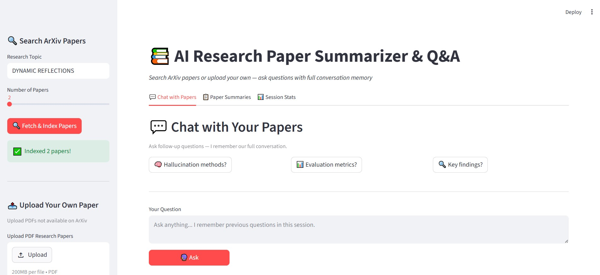

# 📚 AI Research Paper Summarizer & Q&A

An intelligent research assistant that fetches academic papers 
from ArXiv, indexes them using RAG (Retrieval-Augmented Generation), 
and answers questions across multiple papers simultaneously with citations.

---

## 🎯 What It Does

- Fetches research papers from ArXiv based on any topic
- Accepts user-uploaded PDF papers not available on ArXiv
- Generates automatic one-paragraph summaries for every paper
- Answers cross-paper questions with source citations
- Remembers conversation history for natural follow-up questions
- Exports answers as .txt or .pdf files
- Logs all interactions for evaluation and monitoring

---

## 🏗️ RAG Architecture

ArXiv API / PDF Upload
↓
Text Extraction (pypdf)
↓
Chunking (800 chars, 150 overlap)
↓
Embeddings (sentence-transformers: all-MiniLM-L6-v2)
↓
Vector Store (ChromaDB — persistent on disk)
↓
User Question → Semantic Search → Top-5 Chunks Retrieved
↓
Groq LLM (llama-3.3-70b-versatile) + Conversation Memory
↓
Cited Answer with Sources

---

## 🛠️ Tech Stack

| Component | Technology |
|-----------|-----------|
| LLM | Groq API — Llama 3.3 70B (free) |
| Embeddings | sentence-transformers (local) |
| Vector Store | ChromaDB (persistent) |
| Framework | LangChain |
| Paper Source | ArXiv API |
| UI | Streamlit |
| Export | fpdf2 |

---

## ✨ Features

### 1. ArXiv Paper Search
Search any research topic and automatically fetch, 
download, and index the most relevant papers.

### 2. PDF Upload
Upload your own PDF research papers directly into 
the knowledge base — works alongside ArXiv papers.

### 3. Auto Paper Summaries
Every loaded paper gets an AI-generated one-paragraph 
summary so you know what you have before asking questions.

### 4. Conversational Q&A with Memory
Ask follow-up questions naturally:
- Q: What methods reduce hallucinations?
- A: [detailed answer]
- Q: Which of those is most effective? ← remembers context

### 5. Export Answers
Download any answer as a formatted .txt or .pdf file 
with full source citations included.

### 6. Evaluation Harness
Every interaction is logged with similarity scores, 
source count, and citation accuracy for quality monitoring.

---

## 🚀 Setup

### 1. Clone the repository
git clone https://github.com/yourusername/research-paper-qa.git
cd research-paper-qa

### 2. Create conda environment
conda create -n research-qa python=3.11 -y
conda activate research-qa

### 3. Install dependencies
pip install -r requirements.txt

### 4. Get free Groq API key
Go to https://console.groq.com
Create an API key (completely free)

### 5. Create .env file
GROQ_API_KEY=your_groq_api_key_here

### 6. Run the app
streamlit run app.py

---

## 📁 Project Structure

research-paper-qa/
├── src/
│   ├── fetcher.py        # ArXiv paper search and download
│   ├── processor.py      # PDF text extraction and chunking
│   ├── embedder.py       # Embedding generation + ChromaDB
│   ├── retriever.py      # Semantic similarity search
│   ├── generator.py      # LLM answer generation
│   ├── evaluator.py      # Interaction logging and evaluation
│   ├── summarizer.py     # Auto paper summarization
│   ├── memory.py         # Conversation history management
│   └── exporter.py       # Export answers as txt/pdf
├── data/
│   └── papers/           # Downloaded PDFs stored here
├── app.py                # Streamlit web interface
├── main.py               # Command line interface
├── requirements.txt
├── .env                  # API keys (not committed)
└── README.md

---

## 💡 Example Questions to Ask

- "What methods do these papers propose to reduce hallucinations?"
- "How do different papers evaluate model performance?"
- "What are the key findings across these papers?"
- "Which paper presents the most novel approach and why?"
- "What limitations do these papers acknowledge?"

---

## 📊 Evaluation

Run the evaluation harness to test retrieval quality:
python main.py

Results are saved to evaluation_log.csv with:
- Number of sources retrieved per question
- Citation accuracy (whether sources appear in answers)
- Average similarity scores

---

## 🔮 Future Improvements

- Paper comparison mode (side-by-side analysis)
- Confidence scoring per answer
- Related questions suggestion
- Multi-language support
- Web deployment on Streamlit Cloud

---

## 👨‍💻 Author

**Your Name**  
[LinkedIn](https://linkedin.com/in/yourprofile) | 
[GitHub](https://github.com/yourusername)

Built as part of AI/ML portfolio development.
